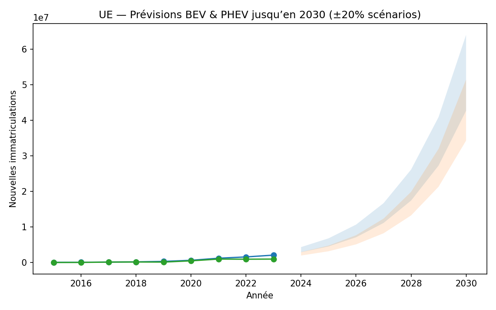

# 🚗 EV Market in Europe (2015–2023) — Forecast 2030

📊 **Data-driven portfolio project** — Analysis of the European EV market using Eurostat data, with a forecast to 2030.  
🔗 Repo: [dontuseitiguess/ev-europe-market](https://github.com/dontuseitiguess/ev-europe-market)

---

## 📌 Project Overview
- Analyse des immatriculations de voitures neuves (Eurostat, 2015–2023).
- Focus sur **Battery Electric Vehicles (BEV)** et **Plug-in Hybrids (PHEV)**.
- Prévision simple jusqu’en **2030**.
- Insights business pour les constructeurs premium (Porsche, BMW, Mercedes, etc.).

---

## 📂 Repository Structure
```
ev-europe-market/
│── data/
│   ├── raw/           # Source Eurostat (TSV)
│   └── processed/     # Cleaned CSVs + forecasts
│── dashboard/         # Exported figures (PNG)
│── notebooks/         # Jupyter Notebooks
│   ├── 01_prepare_data.ipynb
│   ├── 02_eda_visuals.ipynb
│   └── 03_forecast_2030.ipynb
│── REPORT.md          # Full consulting-style report
│── README.md          # Project overview
│── requirements.txt   # Python dependencies
```

---

## 📈 Key Results
- **Top countries**: Germany, France, UK, Norway, Netherlands.  
- **Diesel** en chute libre depuis 2015.  
- **BEV** = moteur principal de croissance.  
- **Forecast 2030**: BEV ~4–5M ventes annuelles en Europe (scénario base).  

📊 Example figure:  



---

## 📑 Reports & Notebooks
- 🔎 [Full Report (REPORT.md)](REPORT.md)  
- 📓 [01 — Data Preparation](notebooks/01_prepare_data.ipynb)  
- 📓 [02 — EDA & Visuals](notebooks/02_eda_visuals.ipynb)  
- 📓 [03 — Forecast 2030](notebooks/03_forecast_2030.ipynb)  

---

## ⚙️ Installation
Clone the repository and install requirements:
```bash
git clone https://github.com/dontuseitiguess/ev-europe-market.git
cd ev-europe-market
pip install -r requirements.txt
```

Launch notebooks:
```bash
jupyter notebook
```

---

## 🚀 Next Steps
- Prévisions par pays (DE, FR, UK, NO).  
- Modèles non-linéaires (ARIMA, Prophet).  
- Dashboard PowerBI/Tableau.  

---

👤 **Author**: Ritej — Portfolio project for data/consulting applications.
